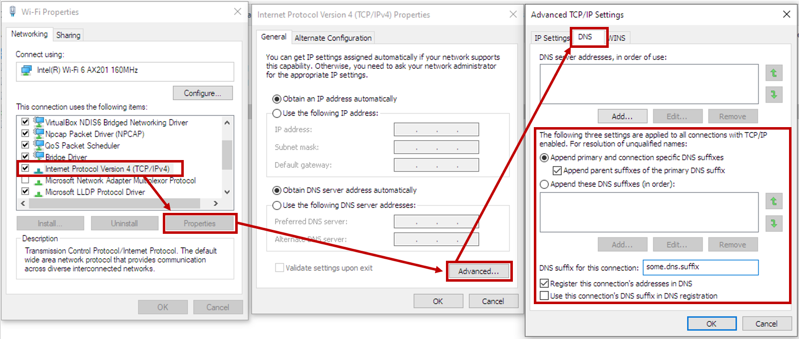

# DNS

## Overview

DNS or the "Domain Name System" is basically how a computer locates another computer/system/resource on a network.
[Cloudflare](https://www.cloudflare.com/learning/dns/what-is-dns/) refers to it as the "phonebook of the Internet".
DNS makes it easy for a human to remember the address of a resource which should be reachable by the network the 
computer is connected to. For example if you were to point your browser to https://ziti.dev some DNS server would
return the [IP address](https://en.wikipedia.org/wiki/IP_address) that represents this name (currently: 162.241.224.35)
DNS is another example of something which seems simple at first but in reality is shockingly complex. 
This page will attempt to inform you about how the Ziti Desktop Edge for Windows works and interacts with DNS.

## DNS Server

With Ziti, it is possible to intercept IP addresses. IP addresses are generally not as easy for a human to remember
as the name of a server/resource on the network. The Ziti Desktop Edge for Windows thus needs to interact with DNS
so that a human can enter a well-known name and expect to be able to access the resource by name. 

In order to interact with DNS the Ziti Desktop Edge for Windows will start a small DNS server of its own. The purpose
of this DNS server is to allow DNS requests made by Windows to be sent to the Ziti Desktop Edge for Windows. There, these
DNS requests are used to identify the [Ziti Service](https://openziti.github.io/ziti/services/overview.html?tabs=create-service-ui)
which to be intercepted. If a match is found the associated IPv4 address is returned that corresponds to the intercepted 
Ziti Service.

The server will listen on the IP address specified in the configuration by the parameter named `TunIpv4` and listens on port 53.

## DNS Resolution

### Windows NRPT

Ziti Desktop Edge for Windows supports Windows 8+ as of spring of 2021.  Windows 8+ has functionality known as
the Name Resolution Policy Table (NRPT). This functionality allows specific DNS requests to be sent to specific DNS
servers. The NRPT is used by the Ziti Desktop Edge for Windows to direct Ziti Services which are meant to be
intercepted to the internal DNS resolver for resolution.  When a new service needs to be intercepted a rule will be
added to the NRPT for that service which will tell windows that for the given intercept names DNS requests should 
be sent to the Ziti Desktop Edge for Windows DNS server for resolution.

If interested in seeing configured NRPT rules. Once a Ziti Desktop Edge for Windows is running - any Ziti Services 
configured to be intercepted can be listed by issuing this powershell command: `Get-DnsClientNrptRule`.

### Fully Qualified Names

The Ziti Desktop Edge for Windows considers DNS requests as "fully qualified" if the query in question
contains any period within it at any position and does not require a request to contain a trailing dot to be fully 
qualified.  For example these would all be considered "fully qualified" names:

* `this.is.an.intercept`
* `my.server.`
* `another-intercept.`

Fully qualified DNS requests will first need to match a rule configured in the NRPT in order to be sent to the Ziti Desktop
Edge for Windows DNS resolve for resolution. If no NRPT rule is matched the DNS request will be sent to the default 
resolvers configured by the operating system.

### Unqualified Domain Names

DNS requests are considered "unqualified" if the query in question does not contain a period. These are requests that
also look more like hostnames such as:

* `my-intercept`
* `my-server-name`
* `myserver`

These requests follow different rules in windows.  Each adapter can have different settings configured. One way to see
the settings of a particular adapter is to open the properties dialog of the interface, and find the IPv4 configuration
as shown in the image below. Click on properties -> Advanced -> DNS as shown and locate the "unqualified names" section:

#### Connection Specific Domains

Notice that it is possible to apply parent suffixes of the primary DNS suffix as well as specify additional suffixes to
apply in order. It is not recommended for "normal" users to have to modify these settings. (NOTE: Only change these 
settings if you are certain you understand the ramifications of making any changes.)

#### DHCP Assigned Domains

DHCP can also assign DNS suffixes which are applied to unqualified names. Generally suffixes applied via DHCP are not
visible on the property pages shown above. These are visible when issuing `ipconfig /all` and are listed under the section
labeled: `Connection-specific DNS Suffix Search List`

#### Resolution

_*ALL*_ network adapters will be used to determine the full list of "Connection Specific Domains". If one adapter has
a Connection Specific Domain of "home" while another has "work" this will result in two Connection Specific Domains being
tracked by the Ziti Desktop Edge for Windows.

All Connection Specific Domains are used to resolve any Ziti Service which uses an unqualified name. If a Ziti Service
is mapped with an unqualified name and the network configuration for the Windows user is set to append DNS suffixes as
shown above then when the DNS request is sent to the Ziti Desktop Edge for Windows it will contain one of the suffixes
configured.  

##### Example

In this example the Windows network has a DHCP applied domain of `from-dhcp` and has been configured to append DNS
suffixes to unqualified requests. A Ziti Service was also created which specifies the intercept as an unqualified name
of simply `my-server`. The users will expect that any network request to `my-server` will be intercepted by the Ziti
Desktop Edge for Windows. Windows will append unqualified DNS requests such as `my-server` with `from-dhcp` resulting
in a DNS query for `my-server.from-dhcp`.

When `my-server.from-dhcp` is sent to the Ziti Desktop Edge for Windows DNS server a precise DNS resolution will first 
be attempted. In this example since the Ziti Service was configured to intercept `my-server` the initial resolution will
fail as `my-server` is expected - but `my-server.from-dhcp` was provided in the DNS query.

Next the Ziti Desktop Edge for Windows will look at each Connection Specific Domain detected and determine if the DNS
request ends with a Connection Specific Domain. In this example the request will indeed match a Connection Specific Domain.
The Ziti Desktop Edge for Windows will then remove the matching domain from the DNS query and attempt to resolve one
final time. Removing `from-dhcp` will result in a resolution request for `my-server` and in this example a match will be
found and the assigned IPv4 address returned as the query answer.

## Subdomains

DNS allows for subdomains. A DNS subdomain is additional qualifying information provided before the rest of the domain.
For example in a DNS query to `www.google.com` the `www` part is considered a subdomain of `google.com` but also `google`
is considered a subdomain of the top level domain (TLD) of `com`.  Subdomains are not resolved by the Ziti Desktop Edge
for Windows.

### Subdomain Example

Consider a Ziti Service configured to intercept `my-server.ziti`. In order for the Ziti Desktop Edge for Windows to 
resolve a DNS request sent to it, it must match exactly. In this example the following queries would produce no matches:

* www.my-server.ziti
* web.my-server.ziti
* anything.else.my-server.ziti

## Other Important Notes

### nslookup

It is important to recognize that tools which are DNS-specific often times do not adhere to the rules Windows tries
to enfoce and thus might bypass the NRPT. One application which does NOT use the NRPT is nslookup. When attempting to
probe the Ziti Desktop Edge for Windows such as when troubleshooting it is better to use powershell's `Resolve-DNSName`
commandlet as it will adhere to and query the NRPT properly.  

If using powershell and `Resolve-DNSName` is not an option, when using `nslookup` provide the server to probe as part
of the `nslookup` command, such as: `nslookup the.intercept.name 100.64.0.1` (replace 100.64.0.1 with the proper IP as
specified).
